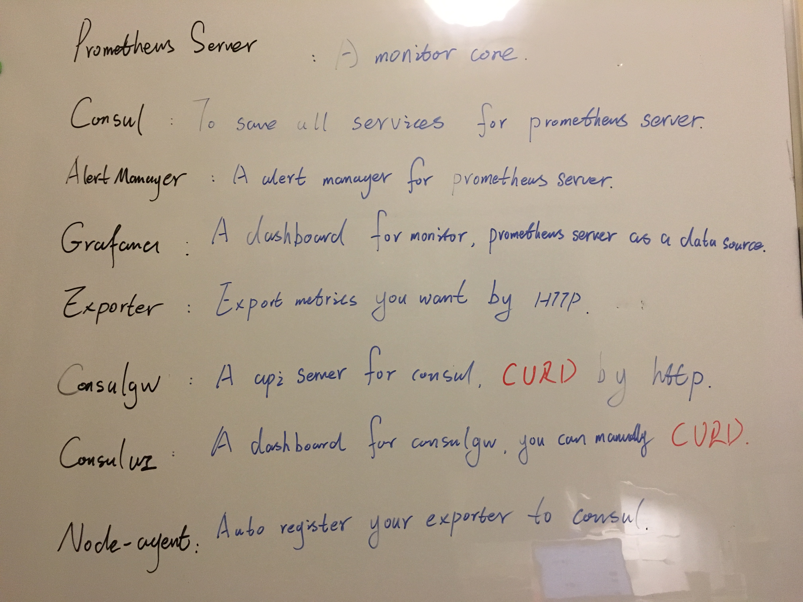
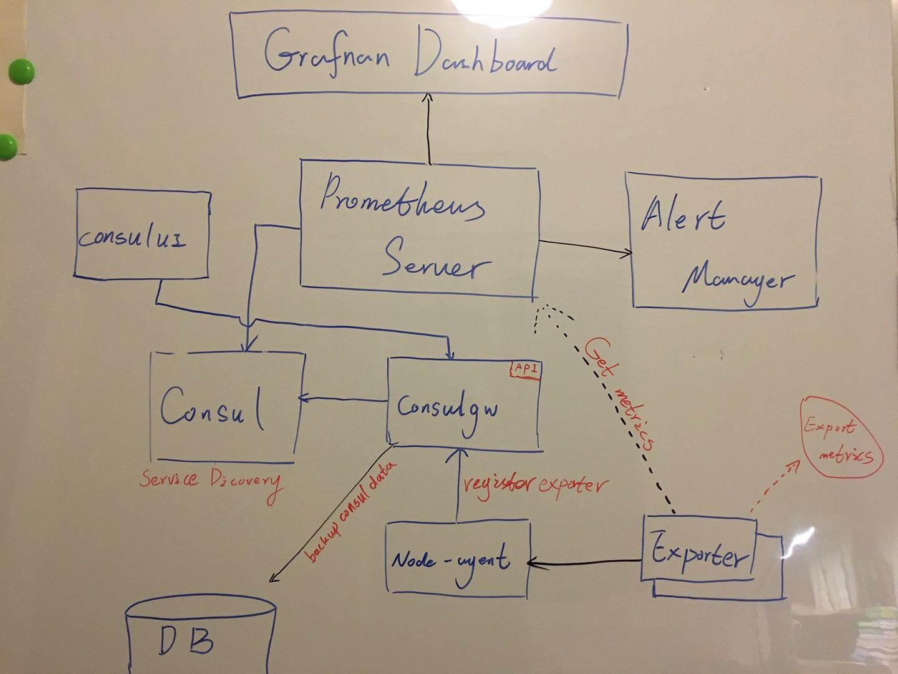
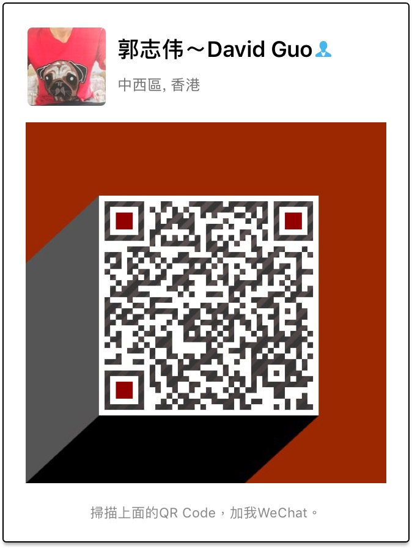

# Docker monitor overview

## All componments

componments.jpg

## Overview structure

## setup
* run **prometheus server** and **alert manager** and **consul**
> please go to [prometheus-config](https://github.com/docker-monitor/prometheus-config), flow the step one by one do it.

* run consul api server
> please go to [consulgw](https://github.com/docker-monitor/consulgw), and flow the doc to setup and run it.

* run a consul api dashboard
> please go to [consului](https://github.com/docker-monitor/consului), and flow the doc to setup and run it.

* run exporter
> please go [exporter](https://github.com/docker-monitor/expoter), flow the doc to setup and run it.

* run noder-agent
> please go to [node-agent](https://github.com/docker-monitor/node-agent), flow the doc to setup and run it.

Later will post some video to show how to setup, before it`s coming, if you have any issues , please contract me, I`m happy to hear your voice.

wechat:

email: david.guo18@yahoo.com/lose.start.david.guo@gmail.com
